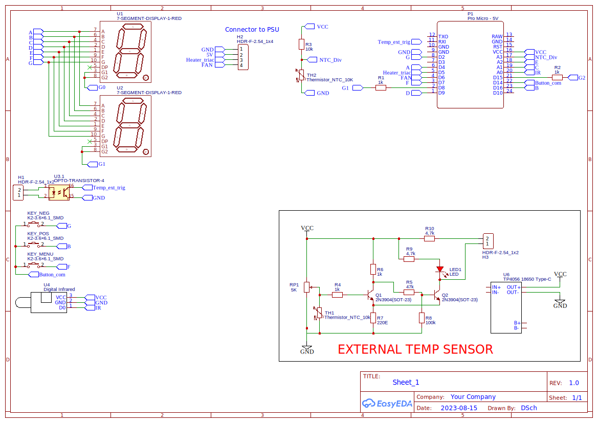

# Warm_Air_Blower_Mod
900w Warm Air blower mod for external temperature triggers

This project aims to replace the unnamed PMS133-S16 of cheap 900w air heaters with a custom controller that supports an external (temperature) trigger

[Example Product](https://www.ebay.de/itm/334900151871)

(yes, the chip is so cheap that they don't even laser the name on)

# Schematic


# Obligatory Disclaimer

```
/*
 * Your warranty is now void.
 *
 * I am not responsible for bricked devices, cold or burnt houses, broken hardware,
 * thermonuclear war, or you dying because you forgot that the Arduno inside is literally plugged into mains.
 * Please do some research if you have any concerns about features included in this project
 * before doing it! YOU are choosing to make these modifications, DO NOT
 * point the finger at me for messing up your device, getting hurt or having something burn down.
 */
```

# !!! DO NOT EXTEND ANY PIN OUTSIDE WITHOUT PROPER ISOLATION !!!

Doing so might kill you since the power supply of that cheap thing uses a simple buck converter. 

SO TREAT EVERYTHING IN THAT THING AS IF IT WERE CONNECTED TO MAINS.
